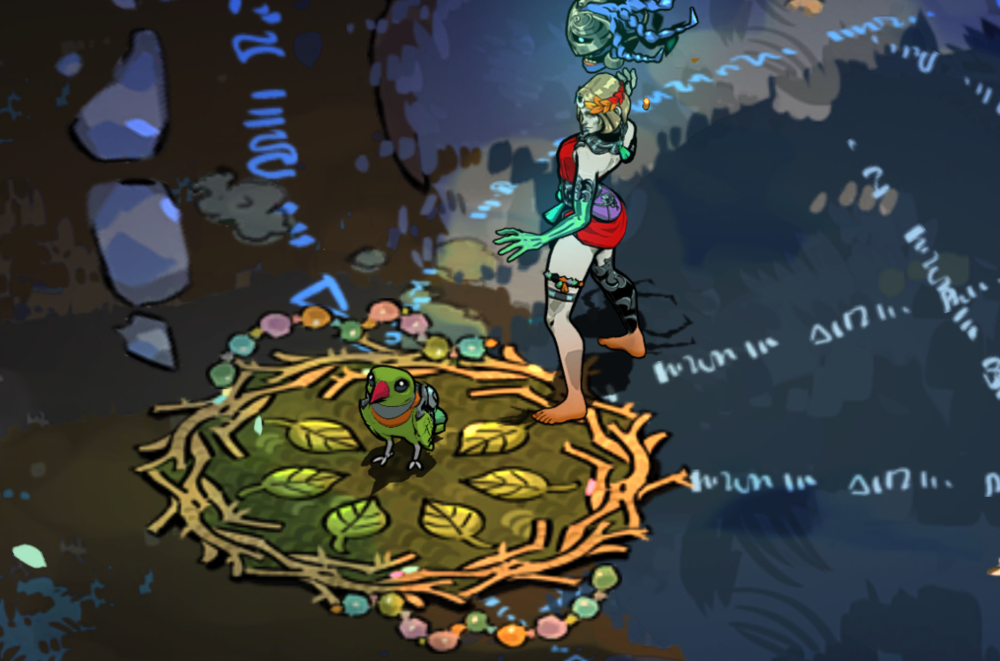

## Familiar Costumes

Hades II mod allowing you to select new cosmetics for familiars. Includes custom skins and uses edited ambient critter textures for some of them.

## Installation

Use r2modman by ebkr from [Thunderstore](https://thunderstore.io/package/ebkr/r2modman/) or [GitHub](https://github.com/ebkr/r2modmanPlus/releases/latest).

While the mod has been tested decently well it is recommended to backup your save from `%USERPROFILE%\Saved Games\Hades II\Profile*.sav` in case there are issues.

## Usage

Buy the new cosmetics from the in-game familiar costume menu.

|  | |
| :-: | :-: |
|  |  |

## Skins

## Adding skins to this mod

TODO

## Contributors

## Issues

Report any issues [here](https://github.com/adi1998/FamiliarCostume/issues) or on [Discord](https://discord.gg/bKvJTAJj)